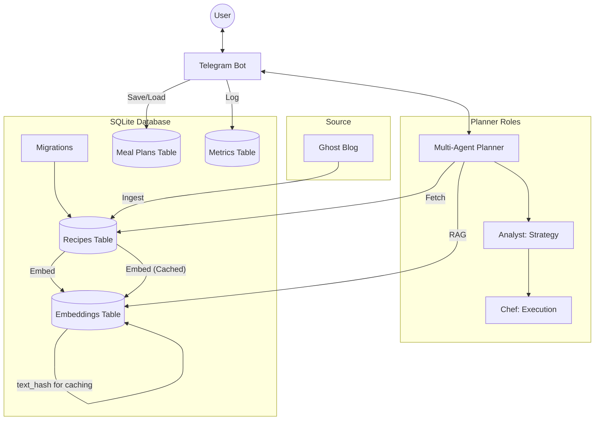

# AI-Assisted Recipe Meal Planner

An **AI Agent project** that connects to your **Ghost CMS** blog, learns your recipes using **Google Gemini**, and generates personalized weekly meal plans using a **multi-agent role-based architecture**.

While originally built as a CLI tool, the project has evolved into an intelligent system where most functionality is handled by a **Telegram Bot**.

## 🚀 Features

*   **Multi-Agent Architecture**: Collaborative specialized agents (Analyst, Chef) work together to refine the strategy and execution of your meal plans.
*   **Ghost CMS Integration**: Automatically fetches and updates recipes from your blog. *Efficiently handles recipe updates, only processing and saving newer versions.*
*   **AI Normalization**: Uses Gemini 1.5 Pro and Groq Llama3 7b to extract structured data (ingredients (with quantities), steps, prep time, servings) from raw HTML posts.
*   **RAG Pipeline**: Generates vector embeddings for every recipe and performs local semantic search to find the best matches for your cravings. *Now with intelligent caching to reduce LLM API calls and improved embedding quality.*
*   **Database Migrations**: Seamless schema evolution for your SQLite database, preserving data across updates.
*   **Observability & Metrics**: Built-in SQLite-backed tracking for token usage, latency, and system health with proactive Telegram alerts for "context bloat".
*   **Recipe Clipper**: Send any recipe URL to the Telegram bot; it extracts the details, publishes them to your Ghost blog, and immediately indexes them for planning.
*   **Batch Cooking & Leftovers**: Smart 5-session cooking cadence that maximizes efficiency by bridging weekday dinners and weekend lunches.
*   **Household Scaling**: Automatically adjusts ingredient quantities based on your household composition (Adults vs. Children).
*   **Telegram Bot Interface**: Chat with your planner, request meals, check `/metrics`, and get instant markdown plans on your phone.
*   **Centralized Storage**: Uses a single, zero-config SQLite database to store all recipes, embeddings, meal plans, and observability metrics. *Now with robust schema management via database migrations.*

## 🛠️ Prerequisites

You need the following API keys:
1.  **Ghost Content & Admin API Keys**: To fetch and publish recipes.
2.  **Google Gemini API Key**: For embeddings (free tier available).
3.  **Groq API Key**: For high-speed LLM inference (free tier available).

## ⚙️ Configuration

Set these variables in your `.env` file or environment:

| Variable                    | Description                         | Default        |
| :-------------------------- | :---------------------------------- | :------------- |
| `GHOST_URL`                 | Your Ghost blog base URL            | Required       |
| `GHOST_CONTENT_API_KEY`     | Ghost Content API Key               | Required       |
| `GHOST_ADMIN_API_KEY`       | Ghost Admin API Key (for Clipper)   | Required       |
| `GEMINI_API_KEY`            | Google Gemini API Key               | Required       |
| `GROQ_API_KEY`              | Groq API Key                        | Required       |
| `TELEGRAM_BOT_TOKEN`        | Token from @BotFather               | Optional (Bot) |
| `TELEGRAM_ALLOWED_USER_IDS` | Comma-separated list of allowed IDs | Optional (Bot) |
| `DATABASE_PATH`             | Path to the SQLite database file    | `data/db/planner.db` |
| `DEFAULT_ADULTS`            | Number of adults for scaling        | `2`            |
| `DEFAULT_CHILDREN`          | Number of children for scaling      | `1`            |
| `DEFAULT_CHILDREN_AGES`     | Comma-separated ages (e.g., `5,8`)  | `5`            |
| `DEFAULT_COOKING_FREQUENCY` | How many times per week to cook     | `4`            |

## ⚡ Quick Start

### 1. Clone the repository
```bash
git clone https://github.com/your-user/ai-meal-planner.git
cd ai-meal-planner
```

### 2. Configure Environment
Set the required environment variables. You can export them in your shell or use a `.env` file manager.

```bash
export GHOST_URL="https://your-blog.com"
export GHOST_API_KEY="your_ghost_content_key"
export GEMINI_API_KEY="your_google_gemini_key"
export GROQ_API_KEY="your_groq_api_key"
```

### 3. Run via CLI (Optional) and Manage Database

**Step 1: Apply Database Migrations**
Before running the application, ensure your database schema is up-to-date.
```bash
make migrate-up
```

**Step 2: Ingest Recipes**
Fetch recipes from Ghost and build the local vector index. This command will automatically run any pending database migrations if you missed Step 1. Run this whenever you add new posts or after a code update that includes schema changes.
```bash
go run ./cmd/ai-meal-planner ingest
```

## 🤖 Telegram Bot (Optional)

You can interact with your meal planner directly via Telegram.

### 1. Create a Bot
Message [@BotFather](https://t.me/BotFather) on Telegram to create a new bot and get your **API Token**.

### 2. Local Development with Localtunnel
Since Telegram uses webhooks, your local server must be accessible from the internet. We recommend `localtunnel` for quick setup (no signup required):

```bash
# 1. Start your local tunnel in a separate terminal
npx localtunnel --port 8080

# 2. Copy the generated URL (e.g., https://fresh-apple-move.loca.lt)

# 3. Export the required variables
export TELEGRAM_BOT_TOKEN="your_bot_token"
export TELEGRAM_ALLOW_USER_ID="your_numeric_id"
export TELEGRAM_WEBHOOK_URL="https://fresh-apple-move.loca.lt/webhook"

# 4. Run the bot
go run ./cmd/telegram-bot
```

## 🛠️ Development

We use a `Makefile` to simplify common tasks.

### Basic Commands
- **Build all binaries**: `make build`
- **Run unit tests**: `make test`
- **Run local ingestion**: `make ingest`

### Database Migrations
- **Apply all pending migrations**: `make migrate-up`
- **Revert the last applied migration**: `make migrate-down`
- **Create a new migration file**: `make migrate-create NAME=<migration_name>`

### 🧪 LLM Evaluations
Since LLM outputs are non-deterministic, we have a specialized "Live Eval" suite that tests agent quality against real-world scenarios. *While caching reduces repeated costs, these tests still hit the real APIs and incur costs for new queries.*

- **Run all Evals**: `make eval`
- **Run specific Agent Eval**: `go test -v ./internal/planner -run TestAnalyst_LiveEval`

---

## 📦 Deployment

This application compiles to a single static binary, making it perfect for low-cost servers like **AWS Lightsail**.

*   **Direct Binary**: Copy the file and run (Recommended).
*   **Docker**: Run as a container.
*   **Automation**: Use `cron` to keep recipes in sync.

👉 **[Read the Full Deployment Guide](DEPLOY.md)**

## 🏗️ Architecture



1.  **Ingestion Service**: Pulls content from Ghost -> Normalizes via LLM (with caching) -> Saves to SQLite.
2.  **Storage**: Centralized SQLite database (`data/db/planner.db`) for all application data, ensuring data integrity and simplified management. *Managed by database migrations.*
3.  **Multi-Agent Planner**: Uses a specialized handover pattern between agents:
    - **Analyst**: Responsible for strategic reasoning, selecting recipes, and enforcing the batch-cooking cadence.
    - **Chef**: Responsible for finalized formatting, scaling ingredient quantities, and consolidating the shopping list.

## ✍️ Why a Blog (Ghost CMS)?

Unlike traditional recipe apps that lock you into a proprietary platform, this project uses a **Blog-First** approach:

*   **Ownership**: You own your content. Your recipes are published on your own blog, not hidden in a private database.
*   **Human-Friendly**: You write recipes for humans (your readers). The AI then "reads" your blog to make it machine-friendly for the planner.
*   **Zero-Maintenance UI**: Ghost provides a beautiful editor and interface for free. We don't need to build a "Recipe Entry" screen because Ghost is already the best at it.
*   **Knowledge Base**: Your blog becomes a living, searchable archive of your family's culinary preferences.

## 💰 Cost-Conscious Design

This tool is built with a **Zero-Cost Goal** in mind for personal use:

*   **Free-Tier AI**: Optimized for the Google Gemini and Groq free tiers. The dual-provider approach ensures you stay within rate limits while spending $0 on LLM tokens for daily planning. *Intelligent embedding caching further minimizes API calls.*
*   **Resource Efficient**: Written in Go with a focus on minimal footprint. With an active memory usage of ~15MB, it is designed to run on extremely low-resource hardware, home servers, or the smallest cloud instances.
*   **No Managed Databases**: By using SQLite, we avoid expensive managed database fees. *Schema changes are now managed gracefully by migrations.*
*   **No Subscription Bloat**: You don't need a monthly subscription to a recipe service. Your only cost is the server you choose to host it on.

## 🔮 Roadmap

*   [x] Core CLI & RAG Pipeline
*   [x] Telegram Bot Integration
*   [x] Recipe Clipper / Importer
*   [x] Batch Cooking & Household Scaling
*   [x] Centralized SQLite Storage
*   [ ] Add more agent-roles

## 📄 License
MIT