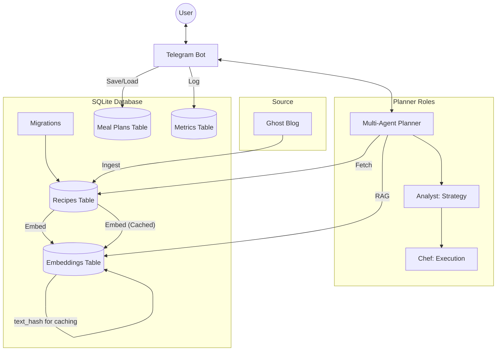

# AI-Assisted Recipe Meal Planner

An **AI Agent project** that connects to your **Ghost CMS** blog, learns your recipes using **Google Gemini**, and generates personalized weekly meal plans using a **multi-agent role-based architecture**.

While originally built as a CLI tool, the project has evolved into an intelligent system where most functionality is handled by a **Telegram Bot**.

## 🚀 Features

*   **Multi-Agent Architecture**: Specialized agents (Analyst for strategy, Chef for execution) collaborate with a handover pattern to refine meal plans.
*   **Ghost CMS Integration**: Automatically fetches and updates recipes from your blog. *Efficiently handles recipe updates, only processing and saving newer versions.*
*   **AI Normalization**: Uses Gemini 1.5 Pro and Groq Llama3 7b to extract structured data (ingredients, quantities, steps, prep time, servings) from raw HTML posts.
*   **RAG Pipeline**: Generates vector embeddings for every recipe and performs local semantic search to find the best matches. *Intelligent caching reduces LLM API calls and improves embedding quality.*
*   **Database Migrations**: Seamless schema evolution for your SQLite database, preserving data across updates.
*   **Observability & Metrics**: Built-in SQLite-backed tracking for token usage, latency, and system health with proactive Telegram alerts for "context bloat".
*   **Recipe Clipper**: Send any recipe URL to the Telegram bot; it extracts the details, publishes to your Ghost blog, and immediately indexes them.
*   **Batch Cooking & Leftovers**: Smart 5-session cooking cadence that maximizes efficiency by bridging weekday dinners and weekend lunches.
*   **Household Scaling**: Automatically adjusts ingredient quantities based on household composition (Adults vs. Children with age adjustments).
*   **Recipe Memory**: Avoids repetition by tracking recently-used recipes and excluding them from future meal plans.
*   **Telegram Bot Interface**: Chat with your planner, request meals, check `/metrics`, and get instant markdown plans on your phone.
*   **Centralized Storage**: Single SQLite database for recipes, embeddings, meal plans, and metrics with robust schema management via migrations.

## 🔄 How It Works

1. **One-time Setup**: Ghost blog recipes are ingested, normalized, and embedded into SQLite
2. **Chat Request**: You message the Telegram bot with meal preferences
3. **Smart Search**: RAG pipeline finds relevant recipes using semantic search
4. **AI Planning**: Multi-agent system creates an optimized meal plan (Analyst selects recipes, Chef scales and formats)
5. **Instant Response**: Receive formatted weekly menu + aggregated shopping list in seconds

---

## 🛠️ Prerequisites

You need the following API keys:
1.  **Ghost Content & Admin API Keys**: To fetch and publish recipes.
2.  **Google Gemini API Key**: For embeddings (free tier available).
3.  **Groq API Key**: For high-speed LLM inference (free tier available).

## ⚙️ Configuration

Create a `.env` file in your project root with the following variables:

### Required (Core Functionality)

| Variable                | Description                  |
| :---------------------- | :--------------------------- |
| `GHOST_URL`             | Your Ghost blog base URL     |
| `GHOST_CONTENT_API_KEY` | Ghost Content API Key        |
| `GEMINI_API_KEY`        | Google Gemini API Key        |
| `GROQ_API_KEY`          | Groq API Key                 |

### Optional (Telegram Bot)

| Variable                    | Description                         | Default |
| :-------------------------- | :---------------------------------- | :------ |
| `TELEGRAM_BOT_TOKEN`        | Token from @BotFather               | -       |
| `TELEGRAM_ALLOWED_USER_IDS` | Comma-separated list of allowed IDs | -       |
| `GHOST_ADMIN_API_KEY`       | Ghost Admin API Key (for Clipper)   | -       |

### Optional (Customization)

| Variable                    | Description                        | Default         |
| :-------------------------- | :--------------------------------- | :-------------- |
| `DATABASE_PATH`             | Path to SQLite database file       | `data/db/planner.db` |
| `DEFAULT_ADULTS`            | Number of adults for scaling       | `2`             |
| `DEFAULT_CHILDREN`          | Number of children for scaling     | `1`             |
| `DEFAULT_CHILDREN_AGES`     | Comma-separated ages (e.g., `5,8`) | `5`             |
| `DEFAULT_COOKING_FREQUENCY` | Cooking sessions per week          | `4`             |

## ⚡ Quick Start

### 1. Clone the repository
```bash
git clone https://github.com/your-user/ai-meal-planner.git
cd ai-meal-planner
```

### 2. Configure Environment
Create a `.env` file in your project root:

```bash
# Required
GHOST_URL="https://your-blog.com"
GHOST_CONTENT_API_KEY="your_ghost_content_key"
GEMINI_API_KEY="your_google_gemini_key"
GROQ_API_KEY="your_groq_api_key"

# Optional: Telegram Bot
TELEGRAM_BOT_TOKEN="your_bot_token"
TELEGRAM_ALLOWED_USER_IDS="12345678,87654321"
```

### 3. Run via CLI (Optional) and Manage Database

**Step 1: Apply Database Migrations**
Before running the application, ensure your database schema is up-to-date.
```bash
make migrate-up
```

**Step 2: Ingest Recipes**
Fetch recipes from Ghost and build the local vector index. This command will automatically run any pending database migrations if you missed Step 1. Run this whenever you add new posts or after a code update that includes schema changes.
```bash
go run ./cmd/ai-meal-planner ingest
```

## 🤖 Telegram Bot (Optional)

You can interact with your meal planner directly via Telegram.

### 1. Create a Bot
Message [@BotFather](https://t.me/BotFather) on Telegram to create a new bot and get your **API Token**.

### 2. Local Development with Localtunnel
Since Telegram uses webhooks, your local server must be accessible from the internet. We recommend `localtunnel` for quick setup (no signup required):

```bash
# 1. Start your local tunnel in a separate terminal
npx localtunnel --port 8080

# 2. Copy the generated URL (e.g., https://fresh-apple-move.loca.lt)

# 3. Export the required variables
export TELEGRAM_BOT_TOKEN="your_bot_token"
export TELEGRAM_ALLOW_USER_ID="your_numeric_id"
export TELEGRAM_WEBHOOK_URL="https://fresh-apple-move.loca.lt/webhook"

# 4. Run the bot
go run ./cmd/telegram-bot
```

## 🛠️ Development

We use a `Makefile` to simplify common tasks.

### Basic Commands
- **Build all binaries**: `make build`
- **Run unit tests**: `make test`
- **Run local ingestion**: `make ingest`

### Database Migrations
- **Apply all pending migrations**: `make migrate-up`
- **Revert the last applied migration**: `make migrate-down`
- **Create a new migration file**: `make migrate-create NAME=<migration_name>`

### 🧪 LLM Evaluations
Since LLM outputs are non-deterministic, we have a specialized "Live Eval" suite that tests agent quality against real-world scenarios. *While caching reduces repeated costs, these tests still hit the real APIs and incur costs for new queries.*

- **Run all Evals**: `make eval`
- **Run specific Agent Eval**: `go test -v ./internal/planner -run TestAnalyst_LiveEval`

---

## 📦 Deployment

This application compiles to a single static binary, making it perfect for low-cost servers like **AWS Lightsail**.

*   **Direct Binary**: Copy the file and run (Recommended).
*   **Docker**: Run as a container.
*   **Automation**: Use `cron` to keep recipes in sync.

👉 **[Read the Full Deployment Guide](DEPLOY.md)**

## 🏗️ Architecture

### Multi-Agent Pipeline

The planner uses a specialized two-stage pipeline:

1. **Analyst Agent**: Strategic reasoning
   - Analyzes your meal preferences and constraints
   - Selects recipes based on semantic search results
   - Enforces the batch-cooking cadence for efficiency
   - Ensures variety and nutritional balance

2. **Chef Agent**: Tactical execution
   - Scales ingredient quantities for your household (adults + children)
   - Consolidates recipes into a unified shopping list
   - Formats the final output as markdown
   - Handles leftovers and meal timing

### System Diagram



1.  **Ingestion Service**: Pulls content from Ghost -> Normalizes via LLM (with caching) -> Saves to SQLite.
2.  **Storage**: Centralized SQLite database (`data/db/planner.db`) for all application data, ensuring data integrity and simplified management. *Managed by database migrations.*
3.  **Multi-Agent Planner**: Uses a specialized handover pattern between agents:
    - **Analyst**: Responsible for strategic reasoning, selecting recipes, and enforcing the batch-cooking cadence.
    - **Chef**: Responsible for finalized formatting, scaling ingredient quantities, and consolidating the shopping list.

## ✍️ Why a Blog (Ghost CMS)?

Unlike traditional recipe apps that lock you into a proprietary platform, this project uses a **Blog-First** approach:

*   **Ownership**: You own your content. Your recipes are published on your own blog, not hidden in a private database.
*   **Human-Friendly**: You write recipes for humans (your readers). The AI then "reads" your blog to make it machine-friendly for the planner.
*   **Zero-Maintenance UI**: Ghost provides a beautiful editor and interface for free. We don't need to build a "Recipe Entry" screen because Ghost is already the best at it.
*   **Knowledge Base**: Your blog becomes a living, searchable archive of your family's culinary preferences.

## 🔧 Troubleshooting

### "No recipes found"
- Ensure you've run `make ingest` at least once to fetch recipes from Ghost
- Verify your `GHOST_URL` and `GHOST_CONTENT_API_KEY` are correct
- Check that your Ghost blog has published posts (recipes are read from published posts)

### "Bot not responding to messages"
- Check that the systemd service is running: `sudo systemctl status meal-planner-bot`
- Verify your `TELEGRAM_BOT_TOKEN` is correct and the bot is not already running elsewhere
- Confirm your Telegram webhook URL is publicly accessible and matches `TELEGRAM_WEBHOOK_URL`
- Check nginx logs: `sudo tail -f /var/log/nginx/error.log`

### "Database schema errors after upgrade"
- Run migrations: `make migrate-up`
- Check that `DATABASE_PATH` directory exists and is writable
- If issues persist, review migration logs in your deployment directory

### "API rate limits or quota exceeded"
- Gemini has a 20-request/day limit on the free tier; use Groq for text generation instead
- Check your usage in the Google Cloud Console and Groq dashboard
- Consider spreading ingestion and planning requests throughout the day

---

## 💰 Cost-Conscious Design

This tool is built with a **Zero-Cost Goal** in mind for personal use:

*   **Free-Tier AI**: Optimized for the Google Gemini and Groq free tiers. The dual-provider approach ensures you stay within rate limits while spending $0 on LLM tokens for daily planning. *Intelligent embedding caching further minimizes API calls.*
*   **Resource Efficient**: Written in Go with a focus on minimal footprint. With an active memory usage of ~15MB, it is designed to run on extremely low-resource hardware, home servers, or the smallest cloud instances.
*   **No Managed Databases**: By using SQLite, we avoid expensive managed database fees. *Schema changes are now managed gracefully by migrations.*
*   **No Subscription Bloat**: You don't need a monthly subscription to a recipe service. Your only cost is the server you choose to host it on.

## 🔮 Roadmap

*   [x] Core CLI & RAG Pipeline
*   [x] Telegram Bot Integration
*   [x] Recipe Clipper / Importer
*   [x] Batch Cooking & Household Scaling
*   [x] Centralized SQLite Storage
*   [ ] Add more agent-roles (Nutritionist, Grocer)
*   [ ] Implement feedback loop for plan refinement

## 🎯 What's Next?

After deploying your planner:

1. **Test the Recipe Clipper**: Send any recipe URL to your Telegram bot and watch it automatically publish to Ghost
2. **Customize Your Profile**: Adjust household settings in `.env` (adults, children, ages, cooking frequency)
3. **Monitor Performance**: Check `/metrics` in Telegram to see token usage and API latency
4. **Explore Agent Behavior**: Read [AI_AGENT_ROADMAP.md](AI_AGENT_ROADMAP.md) to understand the multi-agent system's potential
5. **Set Up Automation**: Configure a cron job to automatically ingest new recipes hourly (see [DEPLOY.md](DEPLOY.md))

**Want to Contribute?** Check [TODO.md](TODO.md) for planned features and architectural decisions.

---

## 📄 License
MIT