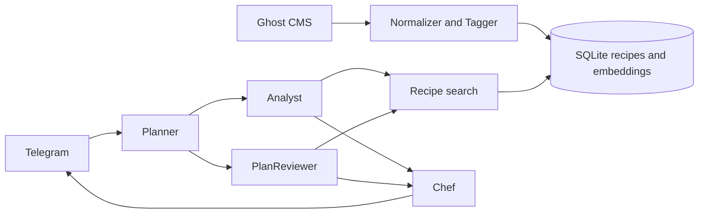

# AI-Assisted Recipe Meal Planner

A Go application that turns recipes from a Ghost blog into personalized weekly meal plans. It normalizes and tags recipes with LLMs, indexes them for semantic search, and serves the planning workflow through Telegram or a CLI.

The project aims to remain practical on free API tiers. Models are selected by role and can be replaced through environment variables when availability or rate limits change.

## Features

- Role-based planning with Analyst, PlanReviewer, and Chef agents
- Recipe ingestion and publishing through Ghost CMS
- Structured recipe extraction and bilingual Portuguese/English tagging
- Semantic recipe retrieval with cached embeddings
- Batch cooking, leftovers, household scaling, and recipe-history awareness
- Telegram planning, recipe clipping, metrics, and alerts
- SQLite storage with migrations and audit logging
- Live evaluations for planning, extraction, tagging, and retrieval quality

## How it works

1. The ingestion command reads recipes from Ghost.
2. The Normalizer extracts structured recipe data and the Tagger creates bilingual tags.
3. Recipe embeddings are stored in SQLite for semantic retrieval.
4. The Analyst searches for recipes and builds a meal strategy.
5. The PlanReviewer applies targeted user changes while preserving the rest of the plan.
6. The Chef scales quantities and produces the final plan and shopping list.

## Requirements

- Go 1.26 or later
- A Ghost Content API key
- A Groq API key
- An embedding-provider API key
- A Telegram bot token if you want to run the bot

## Quick start

Clone the repository:

```bash
git clone https://github.com/sergioazevedo/ai-meal-planner.git
cd ai-meal-planner
```

Create a `.env` file:

```bash
GHOST_API_URL="https://your-blog.com"
GHOST_CONTENT_API_KEY="your_ghost_content_key"
GROQ_API_KEY="your_groq_key"
EMBEDDING_API_KEY="your_embedding_key"

# Optional Telegram interface
TELEGRAM_BOT_TOKEN="your_bot_token"
TELEGRAM_ALLOWED_USER_IDS="12345678,87654321"
TELEGRAM_WEBHOOK_URL="https://your-public-host/webhook"
```

Apply migrations and ingest the recipes:

```bash
make migrate-up
make ingest
```

Run the Telegram bot:

```bash
go run ./cmd/telegram-bot
```

See [DEPLOY.md](DEPLOY.md) for production setup, systemd, nginx, TLS, and GitHub Actions deployment.

## Configuration

Core configuration:

| Variable | Purpose | Default |
| --- | --- | --- |
| `GHOST_API_URL` | Ghost blog URL | Required |
| `GHOST_CONTENT_API_KEY` | Read recipes from Ghost | Required |
| `GHOST_ADMIN_API_KEY` | Publish clipped recipes | Content key |
| `GROQ_API_KEY` | LLM requests | Required |
| `EMBEDDING_API_KEY` | Recipe embeddings | Required |
| `DATABASE_PATH` | SQLite database | `data/db/planner.db` |
| `DEFAULT_ADULTS` | Adults used for scaling | `2` |
| `DEFAULT_CHILDREN` | Children used for scaling | `1` |
| `DEFAULT_CHILDREN_AGES` | Comma-separated child ages | `5` |
| `DEFAULT_COOKING_FREQUENCY` | Cooking sessions per week | `5` |

Each LLM role can be changed independently:

| Variable | Default model |
| --- | --- |
| `GROQ_ANALYST_MODEL` | `openai/gpt-oss-120b` |
| `GROQ_REVIEWER_MODEL` | `openai/gpt-oss-120b` |
| `GROQ_CHEF_MODEL` | `openai/gpt-oss-20b` |
| `GROQ_NORMALIZER_MODEL` | `openai/gpt-oss-20b` |
| `GROQ_TAGGER_MODEL` | `qwen/qwen3.6-27b` |

These are fallback defaults, not permanent assumptions. Override a role when Groq changes model availability or when another model performs better in its eval. See [GROQ.md](GROQ.md) for details.

## Development

Common commands:

```bash
make build       # Build the CLI and Telegram bot
make test        # Run internal tests without live API calls
make eval        # Run all live planner, recipe, and retrieval evaluations
make ingest      # Import and index recipes from Ghost
make retag-all   # Regenerate tags for all local recipes
```

Live evaluations require the relevant API keys and consume provider quota. In CI they fail when credentials are missing rather than silently skipping. Read [TESTING_STRATEGY.md](TESTING_STRATEGY.md) for scenarios, thresholds, and individual commands.

## Architecture


```mermaid
flowchart LR
    Ghost[Ghost CMS] --> Ingestion[Normalizer and Tagger]
    Ingestion --> DB[(SQLite recipes and embeddings)]
    Telegram[Telegram] --> Planner
    Planner --> Analyst
    Planner --> Reviewer[PlanReviewer]
    Analyst --> Search[Recipe search]
    Reviewer --> Search
    Search --> DB
    Analyst --> Chef
    Reviewer --> Chef
    Chef --> Telegram
```

The LLM integration is behind small interfaces, while agent workflows own their prompts and validation. SQLite stores recipes, embeddings, plans, metrics, and audit snapshots.

## Documentation

- [Deployment guide](DEPLOY.md)
- [Testing strategy](TESTING_STRATEGY.md)
- [Groq integration and model configuration](GROQ.md)
- [Embedding API](EMBEDDING_API.md)
- [Agent roadmap](AI_AGENT_ROADMAP.md)
- [Project backlog](TODO.md)

## Cost model

The application is designed to work within free-tier limits, but zero cost is a constraint rather than a guarantee. Live evaluations consume quota, providers can change rate limits, and models can be deprecated. Embedding caching, role-specific models, bounded retries, and explicit live evals reduce that risk.

## License

MIT
